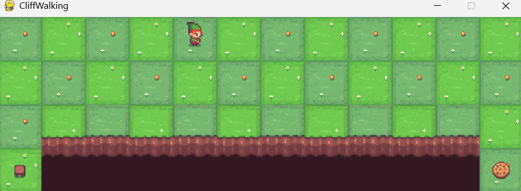

<div align="center">

# SARSA Reinforcement Learning for Cliff Walking

[](https://python.org)
[](https://gymnasium.farama.org/)
[](#)
[](#)
[](https://jupyter.org)

> An implementation of the **SARSA (State–Action–Reward–State–Action)** reinforcement learning algorithm using Gymnasium's Cliff Walking environment. The agent learns an optimal path from the start state to the goal while avoiding the dangerous cliff through on-policy Temporal Difference learning.

</div>

---

# 🎯 Project Overview

This project demonstrates how the **SARSA (State–Action–Reward–State–Action)** algorithm can be used to solve the classic **Cliff Walking** problem from Reinforcement Learning.

The agent begins without any knowledge of the environment and gradually learns the safest path by interacting with the environment over multiple episodes.

Unlike supervised learning, the agent is never given the correct answer. Instead, it improves its policy through trial and error by receiving rewards and penalties.

This project covers the complete Reinforcement Learning workflow including:

- Environment interaction
- State-action value learning
- ε-Greedy exploration
- Temporal Difference (TD) learning
- Q-Table updates
- Policy improvement
- Agent evaluation
- Environment rendering

---

# 🤖 What is Reinforcement Learning?

Reinforcement Learning (RL) is a branch of Artificial Intelligence where an **agent learns by interacting with an environment**.

Instead of learning from labeled data, the agent performs actions, receives rewards or penalties, and gradually improves its behavior to maximize long-term rewards.

The main components of Reinforcement Learning are:

- **Agent** – Learner that takes actions.
- **Environment** – World where the agent operates.
- **State** – Current situation of the agent.
- **Action** – Decision made by the agent.
- **Reward** – Feedback received after taking an action.
- **Policy** – Strategy used by the agent.

---

# 🧠 What is SARSA?

SARSA stands for:

- **S** – State
- **A** – Action
- **R** – Reward
- **S** – Next State
- **A** – Next Action

SARSA is an **On-Policy Temporal Difference Learning** algorithm.

It updates the Q-value using the action that the current policy actually chooses in the next state.

Unlike Q-Learning, SARSA considers the agent's future behavior while learning, making it more conservative and often safer in risky environments like Cliff Walking.

---

# 🏞️ Cliff Walking Environment

The Cliff Walking environment is a popular benchmark problem in Reinforcement Learning.

The objective is to move the agent from the **Start** position to the **Goal** while avoiding the cliff.

### Environment Characteristics

- Grid-based environment
- Discrete state space
- Four possible actions
  - Up
  - Down
  - Left
  - Right
- Goal state provides successful completion
- Falling into the cliff gives a large negative reward and resets the agent.

---

# 🎮 Gameplay Preview

```md

```

---

# 🎯 Reward Structure

| Event | Reward |
|--------|---------|
| Normal Step | -1 |
| Reach Goal | Successful Episode |
| Fall into Cliff | Large Negative Reward & Reset |

The reward system encourages the agent to find the shortest safe path while avoiding dangerous states.

---

# 🚀 Features

- SARSA Algorithm Implementation
- On-Policy Reinforcement Learning
- Cliff Walking Environment
- ε-Greedy Exploration Strategy
- Q-Table Learning
- Temporal Difference Updates
- Policy Improvement
- Gymnasium Environment
- Interactive Environment Rendering
- Reinforcement Learning Visualization

---

# 🧠 Learning Pipeline

## Environment Setup

- Load Gymnasium Cliff Walking environment
- Initialize Q-table
- Define hyperparameters

## Exploration

- ε-Greedy policy
- Random exploration
- Greedy exploitation

## Learning Process

- Observe current state
- Select action
- Receive reward
- Observe next state
- Select next action
- Update Q-table using SARSA equation

## Policy Improvement

- Repeat learning over multiple episodes
- Gradually improve state-action values
- Learn the safest path to the goal

---

# 📚 SARSA Update Rule

The SARSA algorithm updates the Q-value using the following equation:

```text
Q(s,a) ← Q(s,a) + α [ R + γQ(s',a') − Q(s,a) ]
```

Where:

- **Q(s,a)** = Current action-value estimate
- **α (Alpha)** = Learning Rate
- **γ (Gamma)** = Discount Factor
- **R** = Immediate Reward
- **s′** = Next State
- **a′** = Next Action

---

# 📊 Q-Table

The agent stores knowledge in a **Q-Table**, where:

- Rows represent environment states.
- Columns represent possible actions.
- Each value estimates the expected future reward of taking a particular action from a given state.

During training, the Q-table is continuously updated until the agent learns an effective policy.

---

# ⚙️ Model Hyperparameters

| Parameter | Value |
|------------|--------|
| Algorithm | SARSA |
| Environment | CliffWalking-v1 |
| Framework | Gymnasium |
| Episodes | 500 |
| Learning Rate (α) | 0.5 |
| Discount Factor (γ) | 0.99 |
| Exploration Rate (ε) | 0.1 |
| Policy | ε-Greedy |
| State Space | 48 States |
| Action Space | 4 Actions |

---

# 📈 Training Results

The SARSA agent was trained for **500 episodes** using an ε-Greedy exploration strategy.

During training, the agent gradually improved its policy by updating the Q-table after every interaction with the environment.

After sufficient exploration and learning, the agent successfully learned a safe path from the start state to the goal while avoiding the cliff.

### Key Outcomes

- Learned an optimal navigation policy
- Successfully balanced exploration and exploitation
- Reduced risky actions over time
- Improved cumulative rewards through continuous learning
- Demonstrated effective on-policy reinforcement learning
---

# 📂 Project Structure

```text
SARSA-Cliff-Walking-Reinforcement-Learning/
│
├── SARSA.ipynb                # Complete SARSA implementation
├── requirements.txt           # Project dependencies
├── .gitignore                 # Git ignore rules
└── README.md                  # Project documentation
```

---

# 🖥️ Run Locally

### 1. Clone the Repository

```bash
git clone https://github.com/harsh-v16/SARSA-Cliff-Walking-Reinforcement-Learning.git

cd SARSA-Cliff-Walking-Reinforcement-Learning
```

### 2. Install Dependencies

```bash
pip install -r requirements.txt
```

### 3. Launch Jupyter Notebook

```bash
jupyter notebook SARSA.ipynb
```

---

# 📦 Requirements

Create a `requirements.txt` file with the following dependencies:

```text
gymnasium
numpy
matplotlib
pygame
jupyter
```

---

# 📄 .gitignore

Create a `.gitignore` file with the following content:

```gitignore
# Python
__pycache__/
*.pyc

# Jupyter
.ipynb_checkpoints/

# Virtual Environment
venv/
env/

# VS Code
.vscode/

# Operating System Files
Thumbs.db
.DS_Store
```

---

# 🛠️ Tech Stack

| Tool | Purpose |
|------|----------|
| Python | Programming Language |
| Gymnasium | Reinforcement Learning Environment |
| NumPy | Numerical Computation |
| Matplotlib | Visualization |
| Pygame | Environment Rendering |
| Jupyter Notebook | Development Environment |
| GitHub | Version Control |

---

# 📚 Learning Outcomes

Through this project, I learned:

- Fundamentals of Reinforcement Learning
- Markov Decision Process (MDP)
- On-Policy Learning using SARSA
- Temporal Difference (TD) Learning
- Q-Table Initialization and Updates
- ε-Greedy Exploration Strategy
- Balancing Exploration and Exploitation
- State-Action Value Learning
- Working with Gymnasium Environments
- Solving Sequential Decision-Making Problems

---

# 🔍 Key Concepts Demonstrated

- Reinforcement Learning Agent
- Environment Interaction
- Reward-Based Learning
- Q-Table Representation
- SARSA Update Rule
- ε-Greedy Policy
- Temporal Difference Learning
- Policy Improvement
- Sequential Decision Making
- Grid World Navigation

---

# 🔮 Future Improvements

- Implement Q-Learning for comparison
- Compare SARSA and Q-Learning performance
- Implement Expected SARSA
- Add Dyna-Q Planning
- Visualize Episode Rewards
- Plot Learning Curves
- Save and Load Trained Q-Tables
- Extend to Larger Grid Worlds
- Deep Q-Network (DQN) Implementation

---

# 🤝 Contributing

Contributions, suggestions, and improvements are always welcome.

If you have ideas for improving the implementation or adding new Reinforcement Learning algorithms, feel free to fork the repository and submit a pull request.

---

# 👤 Author

<div align="center">

**Harsh Chaudhary**

Computer Engineering Student | Machine Learning & Deep Learning Enthusiast

[](https://github.com/harsh-v16)

[](https://www.linkedin.com/in/harsh-chaudhary-6ba5b8395/)

</div>

---

<div align="center">

⭐ If you found this project useful, consider giving it a star!

</div>
